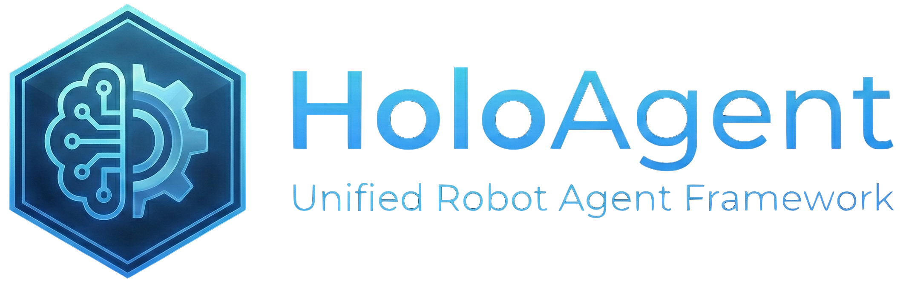

<div align="center">


---

# HoloAgent: Unified Robot Agent Framework

[](https://horizonrobotics.github.io/robot_lab/holoagent/)
[](https://arxiv.org/abs/2606.23565)
</div>

A unified, agentic system for general-purpose robots, enabling multi-modal perception, mapping and localization, and autonomous mobility and manipulation, with intelligent interaction with users.

## 🚀 HoloAgent-0
[](https://horizonrobotics.github.io/robot_lab/holoagent/)
[](https://arxiv.org/abs/2606.23565)
[](#checklist)

> ***HoloAgent-0*** is a unified embodied agent framework for real-world robot deployment. It organizes heterogeneous robot models and controllers through three coupled layers: **Embodied AgentOS** for closed-loop execution, **3D spatial memory** for physical-world grounding, and **embodied skills** for robot action. The framework supports long-horizon navigation, object search, cross-robot coordination, mobile manipulation, and closed-loop execution with runtime feedback.

The HoloAgent-0 project page and paper are now available. The code is not ready yet and will be released in this repository in a future update.

## 🤖 FSR-VLN
[](https://horizonrobotics.github.io/robot_lab/fsr-vln)
[](https://arxiv.org/abs/2509.13733)
[](https://mp.weixin.qq.com/s/HqnBlTNqOL3Z4Kg8tLHCSw)
> ***FSR-VLN*** is a core component of the HoloAgent framework and will be open-sourced soon. It provides natural language guided navigation and intelligent interaction for general-purpose robots, and is built on core agent components such as mapping and localization, multimodal perception, decision-making and planning, and memory management. At its core, FSR-VLN is a vision–language navigation system that integrates a Hierarchical Multi-modal Scene Graph (HMSG) for coarse-to-fine environment representation with Fast-to-Slow Navigation Reasoning (FSR), leveraging VLM-driven refinement to enable efficient, real-time, long-range spatial reasoning.


## Checklist
- [x] Release the project page of HoloAgent-0.
- [x] Release the paper of HoloAgent-0.
- [ ] Release the code of HoloAgent-0.
- [x] Release the code of FSR-VLN.


## 🏗 Pipeline
### 1. Semantic Mapping and Retrieval Pipeline
- **Task:** Implement the semantic mapping and retrieval system based on the instructions in `fsr_vln/README.md`.
- **Steps:**
    1.  Download the necessary pre-trained model checkpoints.
    2.  Download and configure the required datasets.
    3.  Set up the environment and dependencies as specified.
    4.  Run the complete pipeline to verify its functionality for semantic mapping and visual place retrieval.

### 2. Navigation Agent Setup and Execution
- **Task:** Set up and test the navigation agent according to `nav_agent/README.md`.
- **Steps:**
    1.  Install all required dependencies for the navigation environment.
    2.  Configure the necessary parameters and environment settings.
    3.  Execute the navigation agent to ensure it runs successfully and performs its intended tasks.


## 📚 Publications & Citation

If you find our project useful, please consider citing it:

```bibtex
@misc{holoagent2026holoagent0,
      title={HoloAgent-0: A Unified Embodied Agent Framework with 3D Spatial Memory},
      year={2026},
      eprint={2606.23565},
      archivePrefix={arXiv},
      primaryClass={cs.RO},
      url={https://arxiv.org/abs/2606.23565},
}
```

```bibtex
@misc{zhou2025fsrvlnfastslowreasoning,
      title={FSR-VLN: Fast and Slow Reasoning for Vision-Language Navigation with Hierarchical Multi-modal Scene Graph}, 
      author={Xiaolin Zhou and Tingyang Xiao and Liu Liu and Yucheng Wang and Maiyue Chen and Xinrui Meng and Xinjie Wang and Wei Feng and Wei Sui and Zhizhong Su},
      year={2025},
      eprint={2509.13733},
      archivePrefix={arXiv},
      primaryClass={cs.RO},
      url={https://arxiv.org/abs/2509.13733}, 
}
```

---

## ⚖️ License

This project is licensed under the [Apache License 2.0](LICENSE). See the `LICENSE` file for details.
